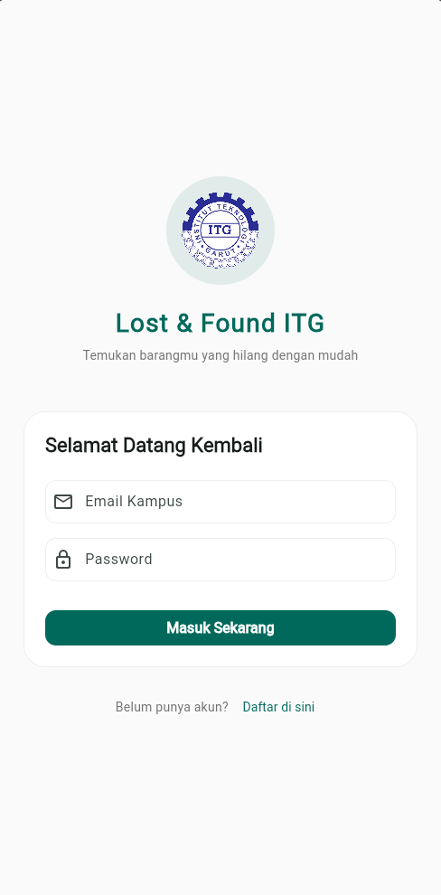
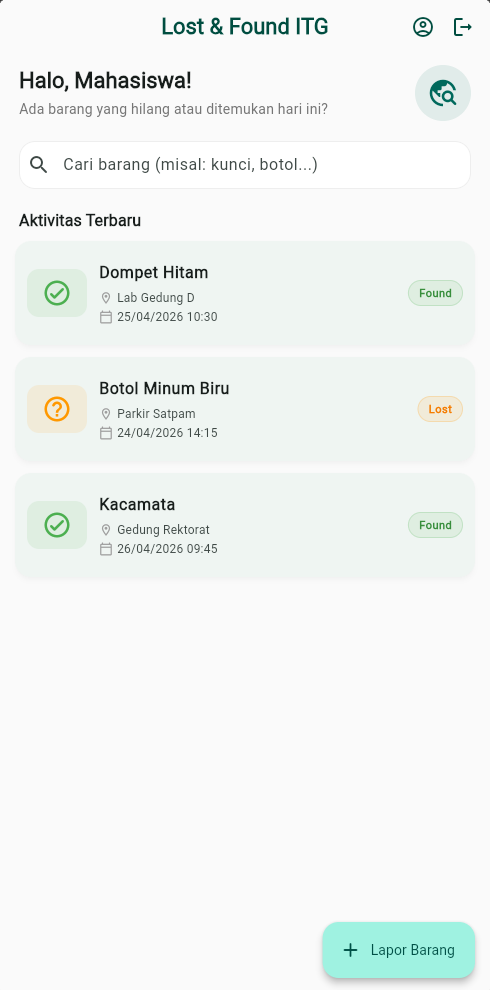
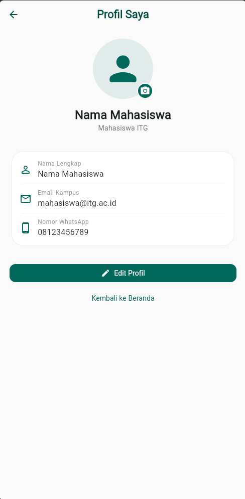
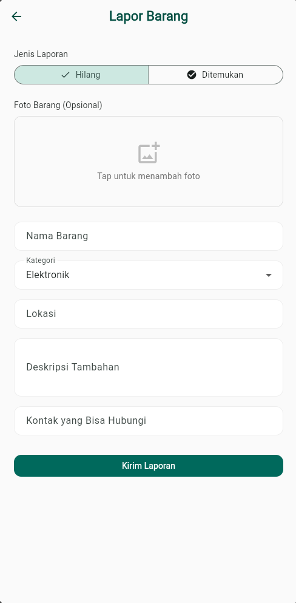
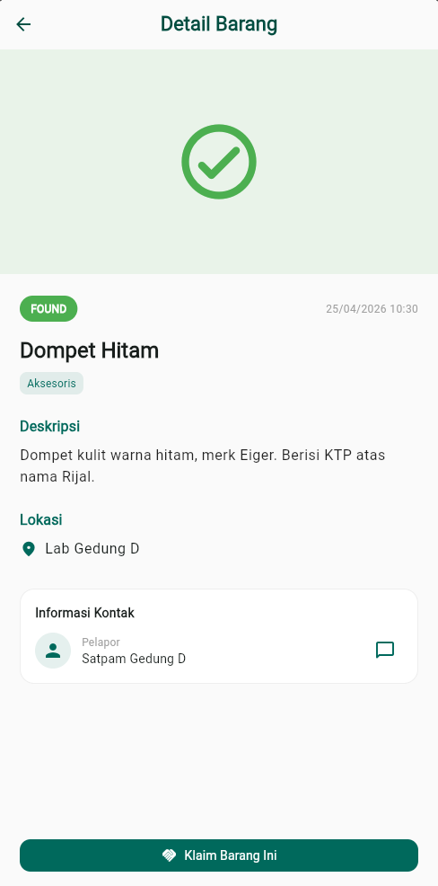

# Lost & Found ITG

Aplikasi pelaporan barang hilang dan ditemukan di lingkungan Institut Teknologi Garut (ITG). Memudahkan civitas akademika melaporkan barang hilang/ditemukan serta mencari barang yang sesuai.

## Tujuan

- Mempermudah pelaporan barang hilang dan ditemukan di lingkungan ITG.
- Mempertemukan pemilik barang hilang dengan penemu secara efisien.
- Mengelola data barang hilang/ditemukan secara terstruktur.

## Fitur

- **Login**: Autentikasi menggunakan email dan password dengan validasi form lokal (tanpa backend, data tidak dikirim ke server).
- **Register**: Pendaftaran akun baru dengan validasi form lokal dan snackbar (data tidak disimpan).
- **Home**: Menampilkan daftar barang hilang dan ditemukan terbaru.
- **Profile CRUD**:
  - **Create**: Inisialisasi data profil dengan nilai default, disimpan ke local storage.
  - **Read**: Membaca data profil (nama, email, nomor HP) dari SharedPreferences.
  - **Update**: Mengubah data profil melalui dialog edit.
  - **Delete**: *Tidak tersedia* (data profil tidak dapat dihapus, hanya dapat diubah).
  - *Keterbatasan*: Penyimpanan hanya di perangkat lokal menggunakan SharedPreferences, data tidak tersinkronisasi ke server.
- **Report Item**: Form pelaporan barang hilang/ditemukan dengan unggahan foto dan detail barang lengkap.
- **Detail Barang**: Tampilan informasi lengkap barang yang dilaporkan termasuk lokasi dan waktu kejadian.
- **Search**: Pencarian barang berdasarkan nama barang dan lokasi.
- **Status**: Pelacakan status laporan barang (lost/found/claimed).

## Teknologi

- **Framework**: Flutter
- **Bahasa**: Dart
- **SDK Constraint**: `>=3.0.0 <4.0.0`

## Dependencies

### Main Dependencies
- `flutter` (SDK)
- `cupertino_icons: ^1.0.8` - Ikon gaya iOS
- `shared_preferences: ^2.3.2` - Penyimpanan data lokal
- `image_picker: ^1.0.4` - Pengambilan gambar dari kamera/galeri
- `flutter_image_compress: ^2.1.0` - Kompresi gambar
- `path: ^1.9.0` - Manipulasi path file

### Dev Dependencies
- `flutter_test` (SDK)
- `flutter_lints: ^6.0.0` - Linter untuk praktik coding yang baik

## Screenshot Aplikasi

### Halaman Login

*Tampilan halaman login dengan validasi email dan password*

### Halaman Home

*Beranda menampilkan daftar barang hilang dan ditemukan*

### Halaman Profil

*Halaman profil pengguna dengan informasi nama, email, dan nomor HP*

### Form Lapor Barang

*Formulir pelaporan barang hilang/ditemukan dengan unggahan foto*

### Detail Barang

*Tampilan detail informasi lengkap barang hilang/ditemukan*

## Cara Menjalankan Aplikasi

### Prasyarat

- Flutter SDK versi `>=3.0.0 <4.0.0` terinstal di sistem.
- Perangkat/emulator Android atau iOS.
- Browser Chrome (opsional untuk versi web).

### Catatan
Aplikasi ini menggunakan penyimpanan lokal sepenuhnya, tidak memerlukan koneksi API eksternal atau file `.env`.

### Langkah-langkah

1. Buka terminal di direktori proyek ini.

2. Unduh semua dependensi yang dibutuhkan:
   ```bash
   flutter pub get
   ```

3. Jalankan aplikasi pada perangkat/emulator:
   ```bash
   flutter run
   ```

   *Opsional: Untuk menjalankan di browser Chrome, gunakan perintah `flutter run -d chrome`*
